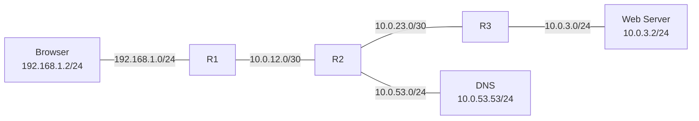
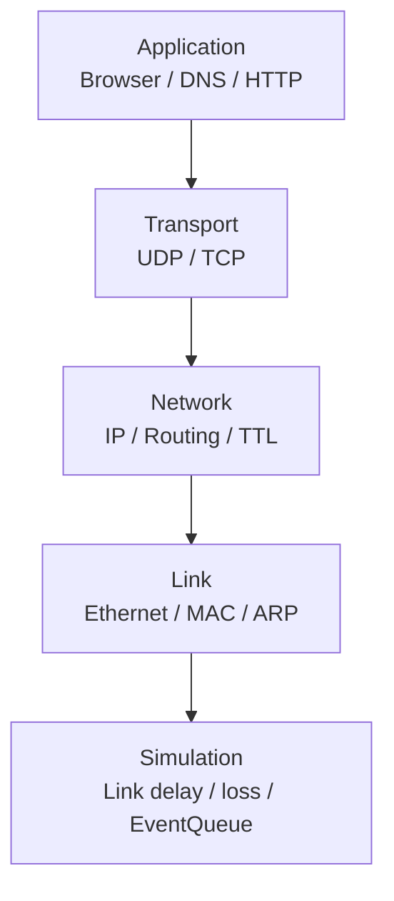
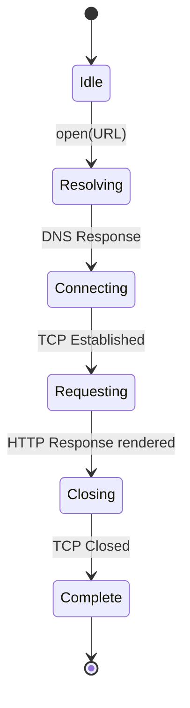
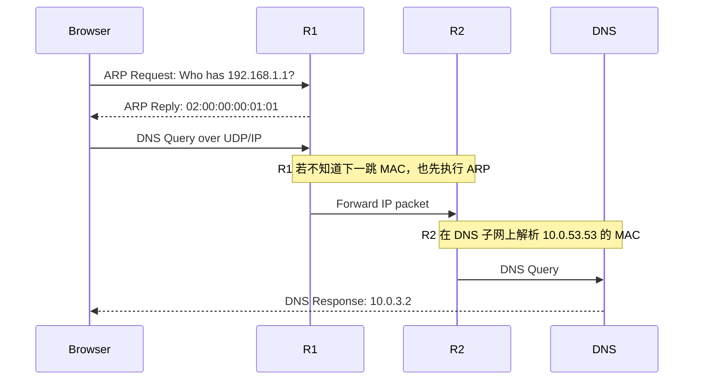
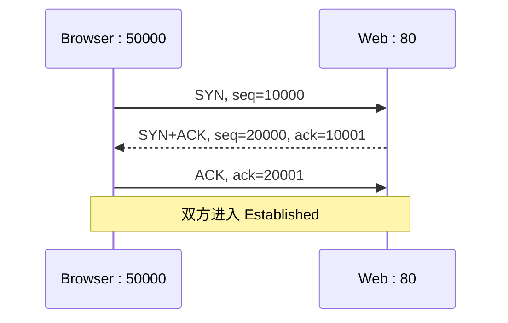
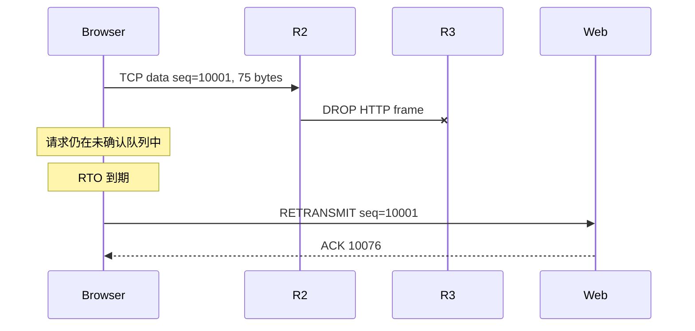
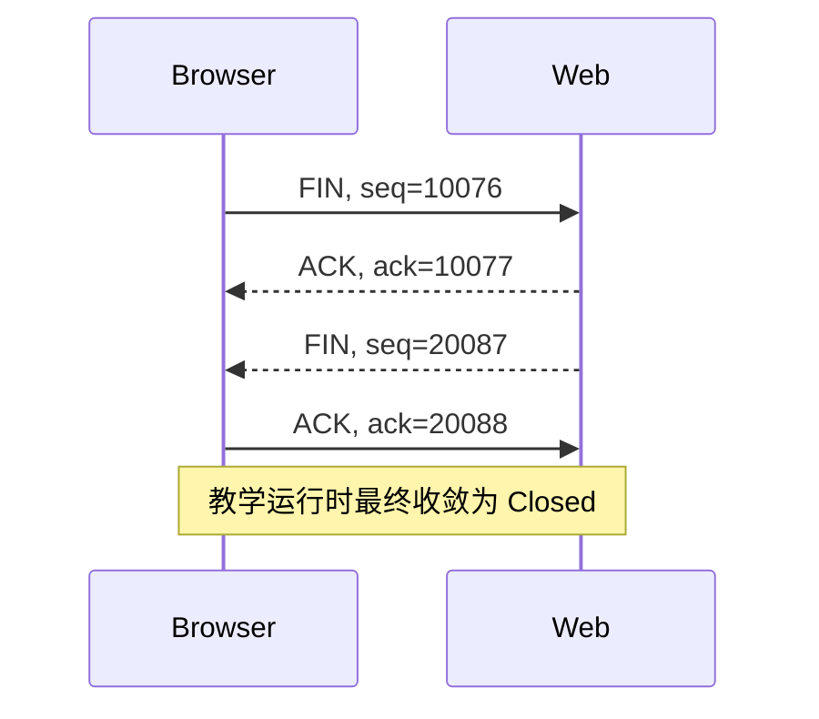
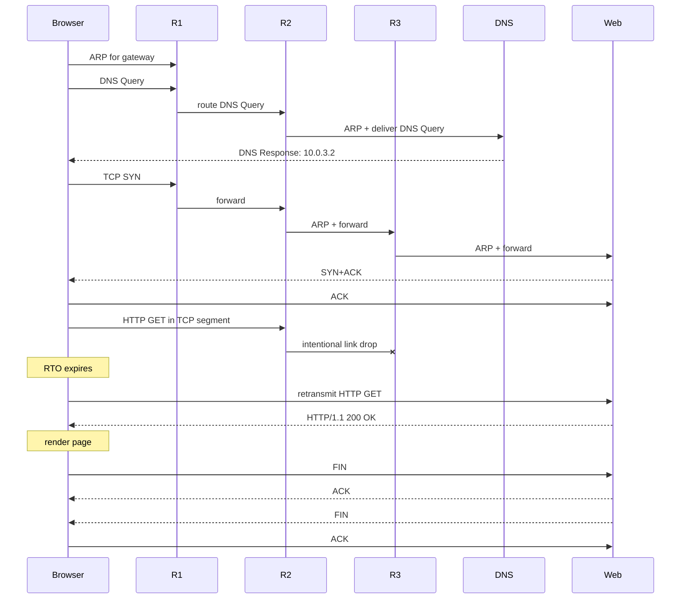
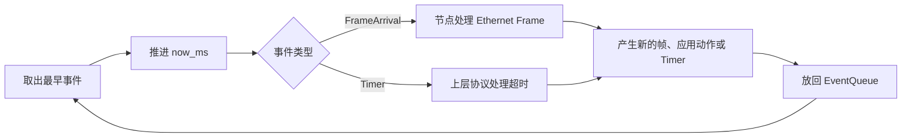
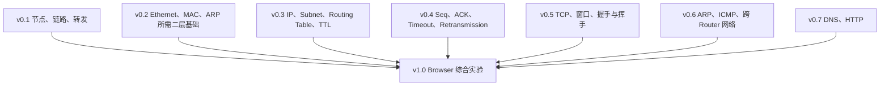

# TinyNet v1.0：Mini Internet（Browser）全流程教学

TinyNet v1.0 的目标不是再添加一个孤立的协议，而是把 v0.1～v0.7 的各层能力组合起来，让一个应用只表达自己的意图：

```rust
browser
    .open(&mut internet, "http://www.tinynet.com/index.html")
    .unwrap();
internet.run().unwrap();
```

Browser 不直接操作 MAC 地址、路由表、TCP 序号或重传定时器。它只负责“打开 URL”，其余工作由下层协议和事件队列自动推进。

最终完成的链路是：

```text
URL
 └─ DNS 查询域名
     └─ ARP 寻找下一跳 MAC
         └─ IP 跨三台 Router 转发
             └─ TCP 三次握手
                 └─ HTTP GET
                     └─ 链路故意丢包
                         └─ TCP 超时重传
                             └─ HTTP 200 响应与页面渲染
                                 └─ TCP 四次挥手
```

## 1. 实验拓扑



所有链路的传播延迟都是 5 ms。关键地址如下：

| 节点/接口 | IP 地址 | MAC 地址 | 说明 |
|---|---|---|---|
| Browser eth0 | `192.168.1.2/24` | `02:00:00:00:01:02` | 默认网关为 `192.168.1.1` |
| R1 browser 侧 | `192.168.1.1/24` | `02:00:00:00:01:01` | Browser 的第一跳 |
| R1 → R2 | `10.0.12.1/30` | `02:00:00:00:0c:01` | 点到点网络 |
| R2 → R1 | `10.0.12.2/30` | `02:00:00:00:0c:02` | 点到点网络 |
| R2 → R3 | `10.0.23.1/30` | `02:00:00:00:17:01` | 点到点网络 |
| R3 → R2 | `10.0.23.2/30` | `02:00:00:00:17:02` | 点到点网络 |
| R2 DNS 侧 | `10.0.53.1/24` | `02:00:00:00:35:01` | DNS 的网关 |
| DNS eth0 | `10.0.53.53/24` | `02:00:00:00:35:35` | 保存 A 记录 |
| R3 Web 侧 | `10.0.3.1/24` | `02:00:00:00:04:01` | Web Server 的网关 |
| Web eth0 | `10.0.3.2/24` | `02:00:00:00:04:02` | TCP 80 端口 |

DNS 中预先安装了下面的记录：

```text
www.tinynet.com  A  10.0.3.2
```

Web Server 中预先安装了下面的资源：

```text
/index.html  ->  <h1>Hello TinyNet!</h1>
```

## 2. 每一层分别负责什么



| 层 | 本实验中的职责 |
|---|---|
| Application | Browser 解析 URL；DNS 解析域名；HTTP 组织请求和响应 |
| Transport | UDP 承载 DNS；TCP 建立连接、确认数据、超时重传和关闭连接 |
| Network | IP 保存端到端地址；Router 查路由表并递减 TTL |
| Link | Ethernet 在相邻设备间传帧；ARP 把下一跳 IP 解析成 MAC |
| Simulation | Link 提供延迟与丢包；EventQueue 按时间顺序驱动整个网络 |

发送 HTTP 请求时，数据会逐层封装：

```text
HTTP Request bytes
  ↓ 放进 TCP Segment
TCP Segment { src_port, dst_port, seq, ack, flags, payload }
  ↓ 放进 IP Packet
IP Packet { src_ip, dst_ip, ttl, payload: Tcp(...) }
  ↓ 放进 Ethernet Frame
Ethernet Frame { src_mac, dst_mac, payload: Ipv4(...) }
  ↓ 进入 Link 和 EventQueue
```

接收端执行相反的解封装过程。每层只阅读自己关心的头部，然后把 payload 交给上一层。

## 3. Browser 是一个状态机

Browser 并不是一次性完成所有动作，而是等待不同协议事件到达后逐步前进：



各状态的含义：

| 状态 | Browser 正在等待什么 |
|---|---|
| `Idle` | 尚未打开 URL |
| `Resolving` | 等待 DNS 返回服务器 IP |
| `Connecting` | 等待 TCP 三次握手完成 |
| `Requesting` | HTTP GET 已发送，等待响应 |
| `Closing` | 页面已得到，等待 TCP 正常关闭 |
| `Complete` | 整个 `open` 流程完成 |

这种设计的关键是：Browser 不循环检查网络状态。DNS 响应、TCP 建连、HTTP 响应等事件会反过来触发下一步动作。

## 4. 第一步：解析 URL

调用：

```text
http://www.tinynet.com/index.html
```

Browser 会得到三个信息：

```text
scheme = http
host   = www.tinynet.com
path   = /index.html
```

此时 Browser 只知道域名，并不知道 Web Server 的 IP 地址，因此不能立即建立 TCP 连接。状态从 `Idle` 进入 `Resolving`，并向配置好的 DNS Server `10.0.53.53:53` 发送查询。

## 5. 第二步：DNS 查询为什么先触发 ARP

DNS 查询使用 UDP：

```text
UDP src port = Browser 临时端口
UDP dst port = 53
IP src        = 192.168.1.2
IP dst        = 10.0.53.53
```

Browser 查看自己的路由表后发现 `10.0.53.53` 不在本地 `192.168.1.0/24` 子网，所以选择默认网关 `192.168.1.1` 作为下一跳。

但是 Ethernet 不能把帧发送给“一个 IP 地址”，它需要目标 MAC。初始 ARP Cache 是空的，于是 DNS 的 IP 包会先进入 `pending_arp`，Browser 广播：

```text
Who has 192.168.1.1? Tell 192.168.1.2.
```

R1 回答自己的 MAC 地址后，Browser 做两件事：

1. 将 `192.168.1.1 -> 02:00:00:00:01:01` 写入 ARP Cache。
2. 取出等待中的 DNS IP 包，封装成 Ethernet Frame 发给 R1。



同样的规则适用于每个 Router：路由表决定“从哪个接口、发往哪个下一跳 IP”，ARP 再决定“这一跳的目标 MAC 是什么”。

## 6. 路由过程中，什么不变，什么会改变

从 Browser 到 DNS 或 Web Server 时，IP 包要经过多个 Router。端到端信息和逐跳信息不同：

| 字段 | 穿越 Router 时是否变化 | 原因 |
|---|---|---|
| 源 IP / 目标 IP | 不变 | 标识通信的两个端点 |
| TCP 源端口 / 目标端口 | 不变 | 标识端到端的应用连接 |
| TCP Seq / Ack | 按 TCP 通信过程变化 | 与可靠字节流有关，不由 Router 修改 |
| IP TTL | 每经过一台 Router 减 1 | 防止路由环路无限转发 |
| 源 MAC / 目标 MAC | 每一跳重新生成 | MAC 只在当前链路有效 |

例如同一个发往 Web Server 的 IP 包：

```text
Browser -> R1: src_mac=Browser, dst_mac=R1
R1      -> R2: src_mac=R1-out, dst_mac=R2-in
R2      -> R3: src_mac=R2-out, dst_mac=R3-in
R3      -> Web: src_mac=R3-out, dst_mac=Web
```

可以把它记成一句话：

> IP 负责端到端，MAC 负责这一跳。

## 7. 第三步：DNS 响应触发 TCP 三次握手

DNS 返回：

```text
www.tinynet.com -> 10.0.3.2
```

Browser 收到对应的 DNS Response 后，从 `Resolving` 进入 `Connecting`，开始连接 `10.0.3.2:80`。



为什么 SYN 会消耗一个序号？因为 TCP 把 SYN 和 FIN 都看作需要确认的控制信息。因此 Client 的第一个数据字节从 `seq=10001` 开始，Server 的第一个数据字节从 `seq=20001` 开始。

在 Demo 的输出中，带 payload 的 TCP 数据段也可能显示为 `[ACK]`。这里的 `[ACK]` 是 TCP 标志位，不表示它一定是“纯 ACK”；一个 TCP Segment 可以同时携带 ACK 标志和应用数据。

## 8. 第四步：发送 HTTP GET，并故意丢包

连接建立后，Browser 从 `Connecting` 进入 `Requesting`，自动生成 HTTP 请求：

```http
GET /index.html HTTP/1.1
Host: www.tinynet.com
Connection: keep-alive
```

请求被序列化为 75 字节，所以它占用的 TCP 序号区间是：

```text
[10001, 10076)
```

实验事先配置为：当 HTTP 请求经过 `R2:eth1` 发往 R3 时，丢弃这一帧。



丢包由 Link 层制造，但是 Link 不负责恢复。TCP 发送请求时做了两件关键的事：

1. 把 Segment 保存在未确认队列中。
2. 安排一个 RTO（Retransmission Timeout）事件。

本实验的 RTO 是 100 ms。因为 ACK 没有在超时前到达，事件队列最终弹出该 Timer，TCP 只重传尚未确认的 `seq=10001` Segment。

这正是分层的价值：Browser 和 HTTP Server 都不需要知道链路曾经丢包，可靠性由 TCP 提供。

## 9. 第五步：HTTP Server 响应，Browser 渲染页面

重传到达 Web Server 后，TCP 将字节交给绑定在 80 端口的 HTTP Server。Server 解析：

```text
method = GET
path   = /index.html
host   = www.tinynet.com
```

它在资源表中找到 `/index.html`，返回：

```http
HTTP/1.1 200 OK
Content-Length: 23
Connection: keep-alive

<h1>Hello TinyNet!</h1>
```

响应同样经过 TCP、IP、Ethernet 和三台 Router 回到 Browser。Browser 解析 HTTP Response，保存响应并“渲染”页面：

```text
┌──────────── Browser ────────────┐
│ http://www.tinynet.com/index.html
│ HTTP/1.1 200 OK
│ <h1>Hello TinyNet!</h1>
└────────────────────────────────┘
```

得到完整响应后，Browser 从 `Requesting` 进入 `Closing`。

## 10. 第六步：TCP 四次挥手

当前教学 Demo 在 Browser 完成一次页面请求后主动关闭连接。虽然消息首部仍使用
`Connection: keep-alive`（v0.7 也借此演示过复用连接），v1.0 的 `open(URL)` 验收流程
选择在渲染完成后进入 `Closing`，从而把四次挥手也纳入一次完整实验：



四次挥手之所以通常是四个报文，是因为 TCP 是全双工的：Browser 表示“我没有数据要发了”，不等于 Web Server 也已经完成发送。两个方向需要分别关闭。

FIN 也会占用一个序号，因此 Browser 发出 `seq=10076` 的 FIN 后，期待对方确认 `ack=10077`。

## 11. 完整时间线

下面是本实验的一条典型时间线。具体日志以程序运行结果为准：



Demo 中值得观察的时间点包括：

```text
t=0ms    Browser 首次 ARP 默认网关
t=15ms   R1 为下一跳 R2 执行 ARP
t=30ms   R2 为 DNS 执行 ARP
t=60ms   DNS 解析完成，Browser 发出 SYN seq=10000
t=70ms   R2 为 R3 执行 ARP
t=85ms   R3 为 Web Server 执行 ARP
t=100ms  Web Server 发出 SYN+ACK seq=20000
t=130ms  R2:eth1 故意丢弃 HTTP 数据帧
t=220ms  Browser 的 seq=10001 超时并重传
t=240ms  Web Server 处理 GET /index.html，返回 200
t=260ms  Browser 渲染响应并发送 FIN seq=10076
t=280ms  Web Server 发送 FIN seq=20087
```

## 12. EventQueue 如何让网络“自己运行”

`Network` 不使用真实线程和真实时间，而是维护一个按时间排序的事件队列。主要事件只有两类：

```rust
enum NetworkEvent {
    FrameArrival { /* ... */ },
    Timer { /* ... */ },
}
```

例如一条延迟 5 ms 的 Link 在 `t=20ms` 发送帧，不会立刻调用接收节点，而是安排一个 `t=25ms` 的 `FrameArrival`。TCP 的重传也不会阻塞等待，而是安排未来的 `Timer`。



`internet.run()` 会不断取出最早事件、推进模拟时间并处理它，直到队列为空。因此外部 Demo 不需要手动写“先 DNS，再 TCP，再 HTTP”的流程控制。

## 13. v0.1～v1.0 在这个实验中的汇合



v1.0 的真正意义是“组合”：

- DNS 不再直接返回答案，而是通过 UDP/IP/Ethernet 跨网络通信。
- TCP 不再由 Demo 手动交换 Segment，而是由真实的帧到达事件驱动。
- ARP Cache 初始为空，解析下一跳的过程会真实发生。
- Router 有多接口，每一跳都重新封装 Ethernet Frame。
- Link 可以丢包，TCP 会通过 Timer 自动恢复。
- Browser 只调用一次 `open(URL)`，最终状态自动到达 `Complete`。

## 14. 如何运行与观察

在项目根目录运行：

```powershell
cargo run
```

然后选择：

```text
8  v1.0  Mini Internet（Browser + Chat）
```

建议第一次运行时依次寻找以下日志：

1. `[ARP]`：当前节点正在解析哪个下一跳。
2. `[DNS]`：域名何时变成 Web Server IP。
3. `[TCP] SYN` 与 `[TCP] SYN+ACK`：连接何时建立。
4. `[LINK] DROP`：HTTP 请求在哪一跳丢失。
5. `[RTO]` 与 `RETRANSMIT`：TCP 如何恢复。
6. `[HTTP] GET /index.html -> 200`：应用层何时真正收到请求。
7. `[Browser] render HTTP 200`：页面何时完成。
8. `FIN` 与最终状态：连接是否正常关闭。

最终验收应看到：

```text
Browser = Complete
Client TCP = Closed
Server TCP = Closed
```

## 15. 代码阅读路线

建议按照下面的顺序阅读代码：

1. `src/demo.rs`：找到 `demo_v10_browser_open`，先看拓扑、DNS 记录、HTTP 资源和故障注入。
2. `src/internet.rs`：查看 `BrowserState`、`Browser::open` 和 Browser 收到 DNS/TCP/HTTP 事件后的状态转换。
3. `src/network.rs`：查看 `NetworkEvent`、Link 延迟/丢包和优先事件队列。
4. `src/routing.rs` 与 `src/host.rs`：理解路由选择、TTL 和下一跳。
5. `src/packet.rs`：理解 ARP、Ethernet、IP 与 `IpPayload` 的封装。
6. `src/tcp.rs`：理解 Seq、ACK、RTO、三次握手与四次挥手。
7. `src/dns.rs`、`src/udp.rs`、`src/http.rs`：最后看应用数据如何编码、传输和解析。

阅读时始终带着三个问题：

1. 当前数据属于哪一层？
2. 当前节点只处理本层头部，还是应该把 payload 上交？
3. 下一步动作由谁触发：应用、帧到达，还是 Timer？

当这三个问题都能从代码中回答时，TinyNet v1.0 的整体结构就真正串起来了。
